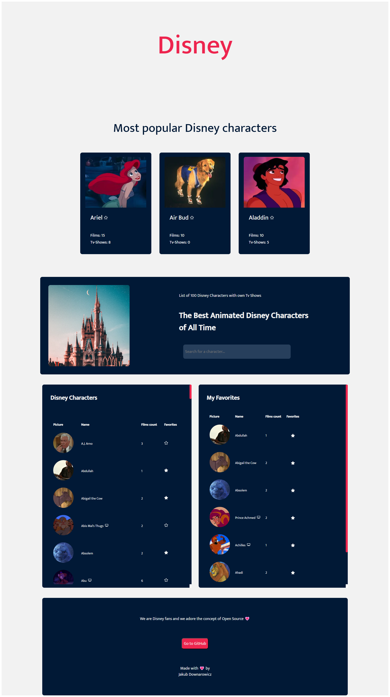

Certainly! Here's a sample README.md file for your Disney characters project:


# Disney Characters App

The Disney Characters App is a web application that allows users to explore a list of Disney characters, mark their favorite characters, and search for specific characters. This project demonstrates the use of React, Zustand for state management, and styled-components for styling.



## Table of Contents
- [Features](#features)
- [Installation](#installation)
- [Usage](#usage)
- [Project Structure](#project-structure)
- [Contributing](#contributing)
- [License](#license)

## Features

- View a list of Disney characters with details like name, picture, films count, and favorite status.
- Mark characters as favorites and view them in a separate "Favorites" section.
- Search for characters by name using the search bar.
- See a tooltip with TV shows when hovering over a character with TV shows.
- Responsive design for various screen sizes.

## Installation

1. Clone this repository to your local machine:

   ```shell
   git clone https://github.com/your-username/disney-characters-app.git
   ```

2. Change to the project directory:

   ```shell
   cd disney-characters-app
   ```

3. Install the project dependencies using npm:

   ```shell
   npm install
   ```

## Usage

1. Start the development server:

   ```shell
   npm start
   ```

2. Open your web browser and visit [http://localhost:3000](http://localhost:3000) to use the Disney Characters App.

3. Explore the list of Disney characters, mark your favorites, and use the search bar to find specific characters.

## Project Structure

The project is structured as follows:

- `src/`: Contains the source code for the application.
  - `components/`: React components used to build the app.
  - `services/`: API service and interface definitions.
  - `store/`: Zustand store for managing application state.
  - `App.js`: The main entry point of the application.
- `public/`: Static assets and HTML template.
- `package.json`: Project dependencies and scripts.
- `README.md`: This README file.

## Contributing

Contributions to the Disney Characters App are welcome! Feel free to open issues, fork the repository, and submit pull requests to help improve the project.

## License

This project is licensed under the MIT License - see the [LICENSE](LICENSE) file for details.

